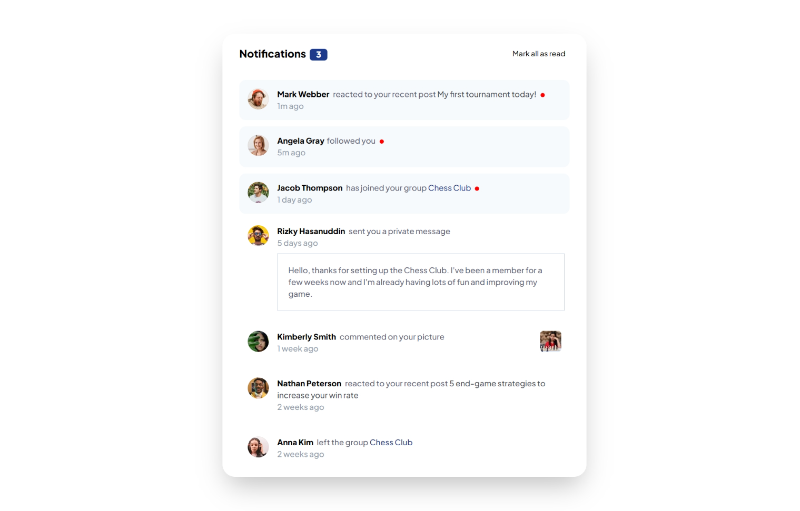

 Notification Page

## Table of contents

- [Overview](#overview)
  - [Screenshot](#screenshot)
  - [Links](#links)
- [My process](#my-process)
  - [Built with](#built-with)
- [Author](#author)

**Note: Delete this note and update the table of contents based on what sections you keep.**

## Overview

### Screenshot

### Links

- Solution URL: [solution URL ](https://www.frontendmentor.io/solutions/qr-code-component-using-tailwindcss-QtOP2y7qV3)
- Live Site URL: [Live URL](https://karansingh2666.github.io/Notification-page-main/)

## My process

### Built with

- Semantic HTML5 markup
- CSS custom properties
- Tailwind css
- Flexbox
- CSS Grid
- Mobile-first workflow

## Author
- Github - [KaranSingh266](https://github.com/KaranSingh2666)
- Frontend Mentor - [@KaranSingh2666](https://www.frontendmentor.io/profile/KaranSingh2666)
<!-- - Twitter - [@yourusername](https://www.twitter.com/yourusername) -->
 🚀
